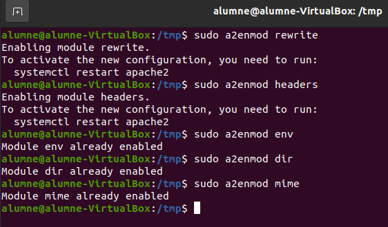

# Instalar Owncloud en Ubuntu 20.04 LTS.

Per instalar el apache2 fem la comanda 

Desactivem el llistat de directoris del servidor:

# Instalar MariaDB:

Instal·lem MariaDB

I configurem la instal·lació:

Aquí hem de modificar el seguent:

Finalment reiniciem el servidor MariaDB.

Crear la base de dades d'owncloud:

Entrem a MariaDB:

Creem la base de dades:

Creem un usuari anomenat ownclouduser amb una contrasenya que podria ser Admin1234.

Us donem accés a l'usuari a la base de dades creada:

Apliquem els canvis i sortim:

FLUSH PRIVILEGES;
EXIT;

# Instal·lar PHP i els seus mòduls necessaris:

Actualitzem els paquets amb el repositori afegit:

Instal·lem PHP i els mòduls necessaris:

Hem de tenir en compte els requisits d'Owncloud abans d'instal·lar els mòduls.

Després de la instal·lació editem el fitxer php.ini i canviarem alguns valors:

Els valors que hem de canviar són els següents:

file_uploads = On allow_url_fopen = On memory_limit = 256M upload_max_filesize = 100M display_errors = Off date.timezone = Europe/Madrid

# Instal·lem Owncloud:

Descarreguem la darrera versió del programa i descomprimim els fitxers, a més movem els fitxers d'Owncloud a "/var/www/html/owncloud".

Canviem propietari i permisos dels directoris d'owncloud. www-data perquè els pugui fer servir Apache, 755 perquè els pugui executar i llegir qualsevol usuari de Linux:

# Configurar Apache:

Configurarem Apache:

Hem de deixar un fitxer com el següent, però canviant el ServerName i el ServerAlias pels noms i àlies del nostre propi domini.

Habilitem owncloud i el mòdul rewrite:

Reiniciem Apache:

A partir d'aquest moment podem accedir a owncloud des del navegador per això hem d'introduir la nostra IP seguida de "/owncloud" al mateix, per exemple si la nostra IP és 172.31.84.197 posarem al navegador 172.31.84.197/owncloud i podrem accedir al servei.

Ja al navegador creem un compte d'administració i posem les dades de MariaDB que hem configurat anteriorment.

# Que es apache

La funcionalitat principal daquest servei web és servir als usuaris tots els fitxers necessaris per visualitzar el web. Les sol·licituds dels usuaris es fan normalment mitjançant un navegador (Chrome, Firefox, Safari, etc.).

Per exemple, quan un usuari escriu al seu navegador dinahosting.com, aquesta petició arribarà al nostre servidor Apache que mitjançant el protocol HTTP aquest s'encarregarà de facilitar-vos els textos, imatges, estils, etc. que conformen la portada de la nostra web de manera segura.

Apache té una estructura basada en mòduls, que permet activar i desactivar funcionalitats addicionals, per exemple, mòduls de seguretat com mod_security, mòduls de memòria cau com Varnish, o de personalització de capçaleres com mod_headers. També permet ajustar els paràmetres de PHP del teu hosting de manera personalitzada mitjançant el fitxer .htaccess.

## Què fa la comanda a2ensite?
Enjaga el owncloud

## I la comando a2dissite?
Apaga el owncloud

## Què significa la línia de /etc/hosts
Aqui configurem els nostres dominis que voldrem entrar a la nostra pagina de owncloud.
